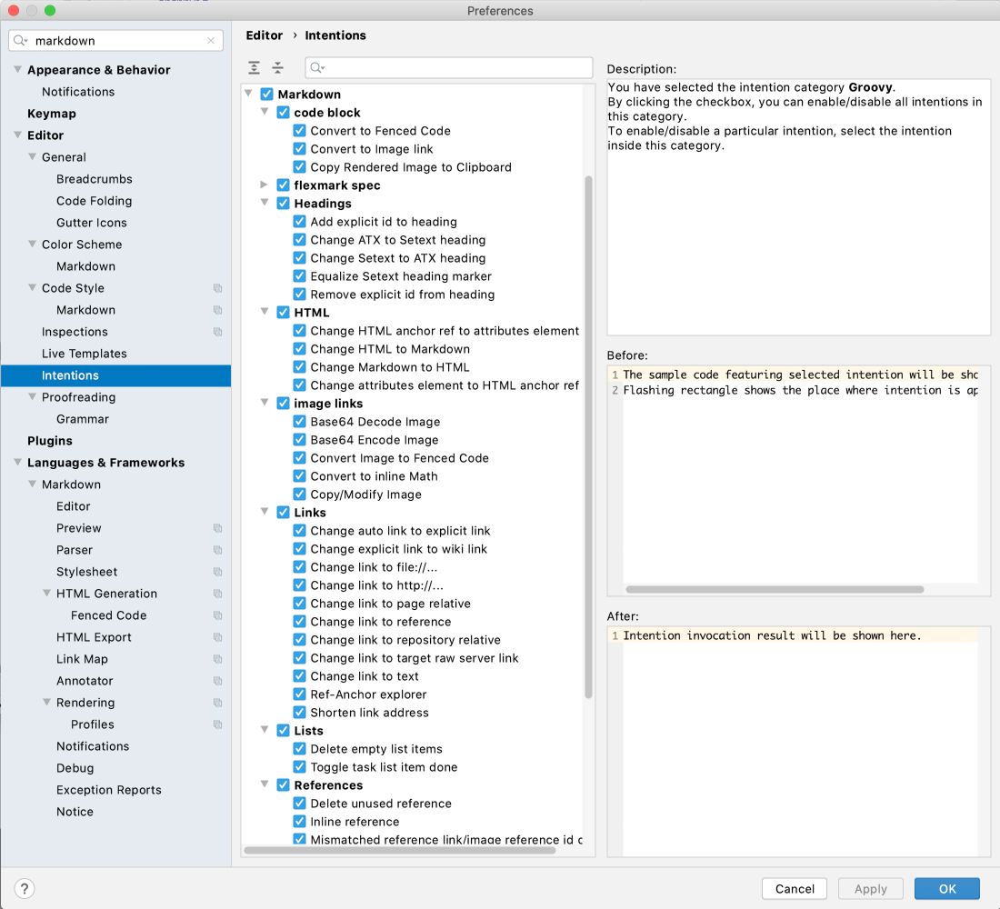
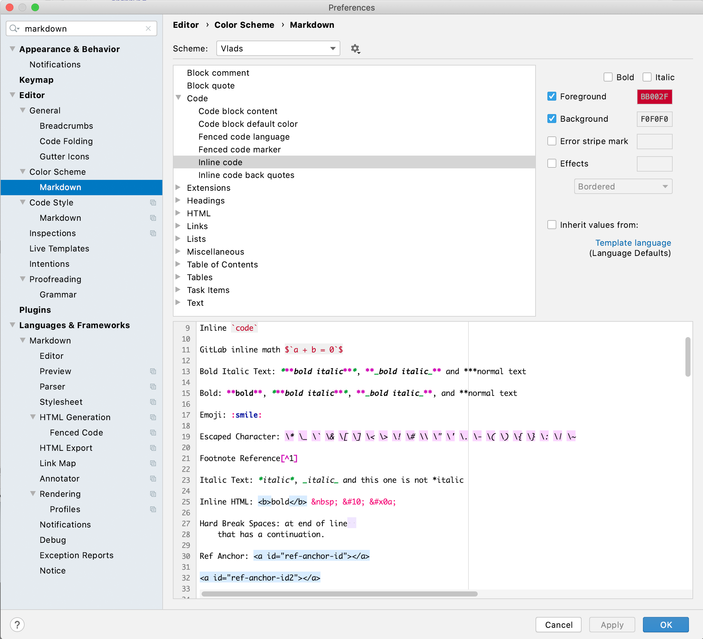
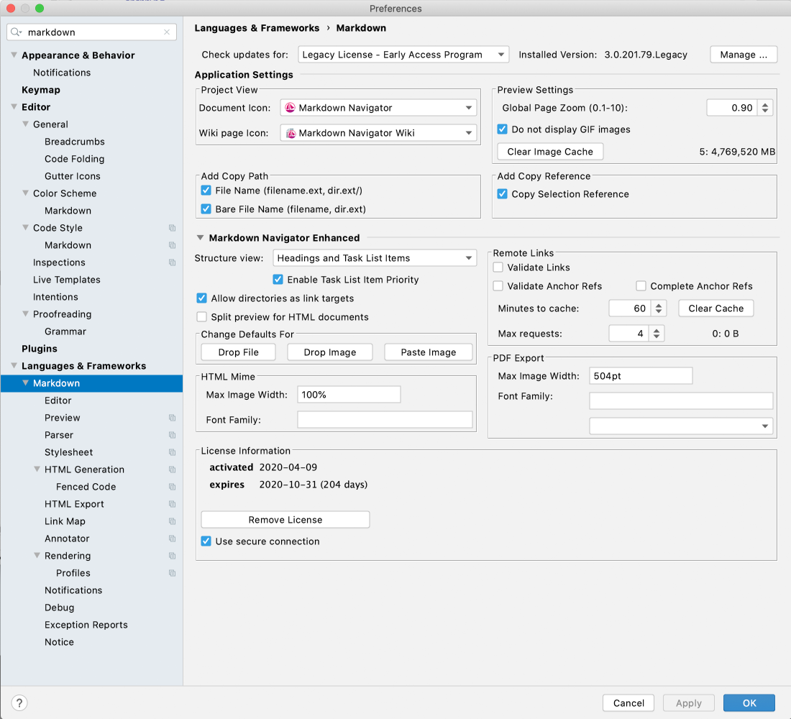
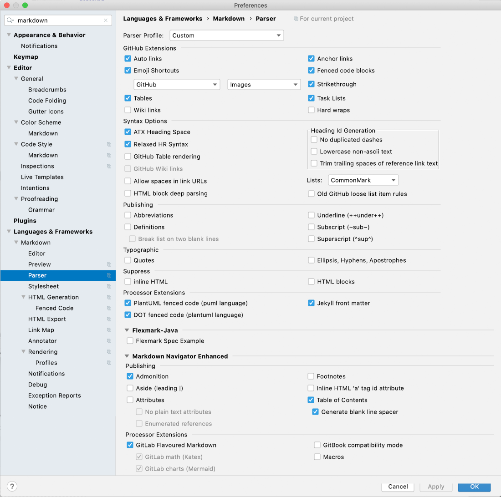
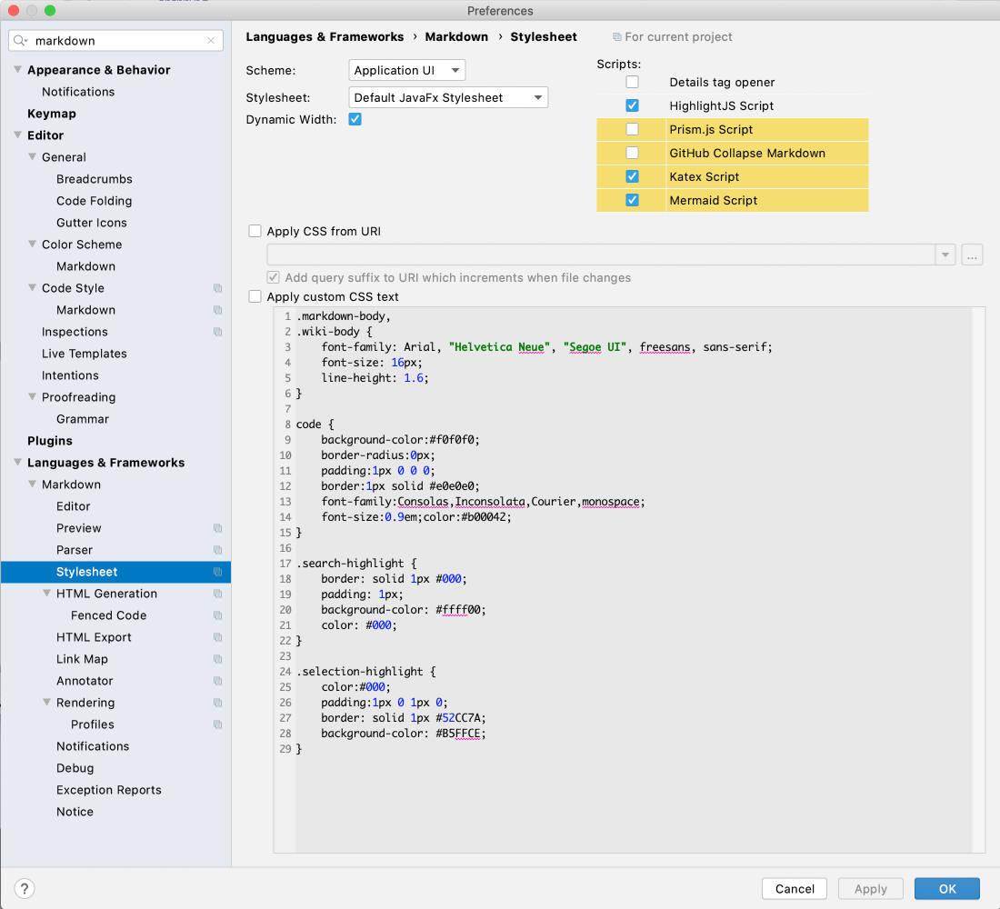
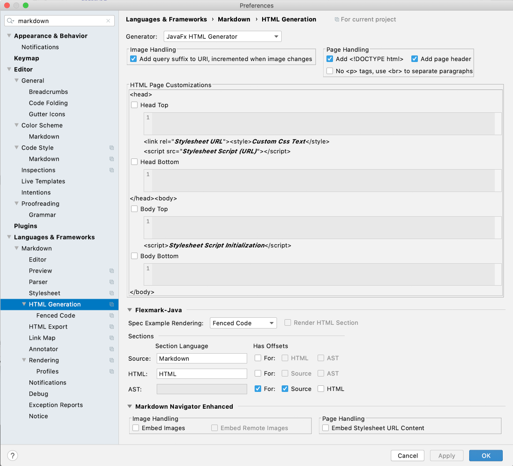
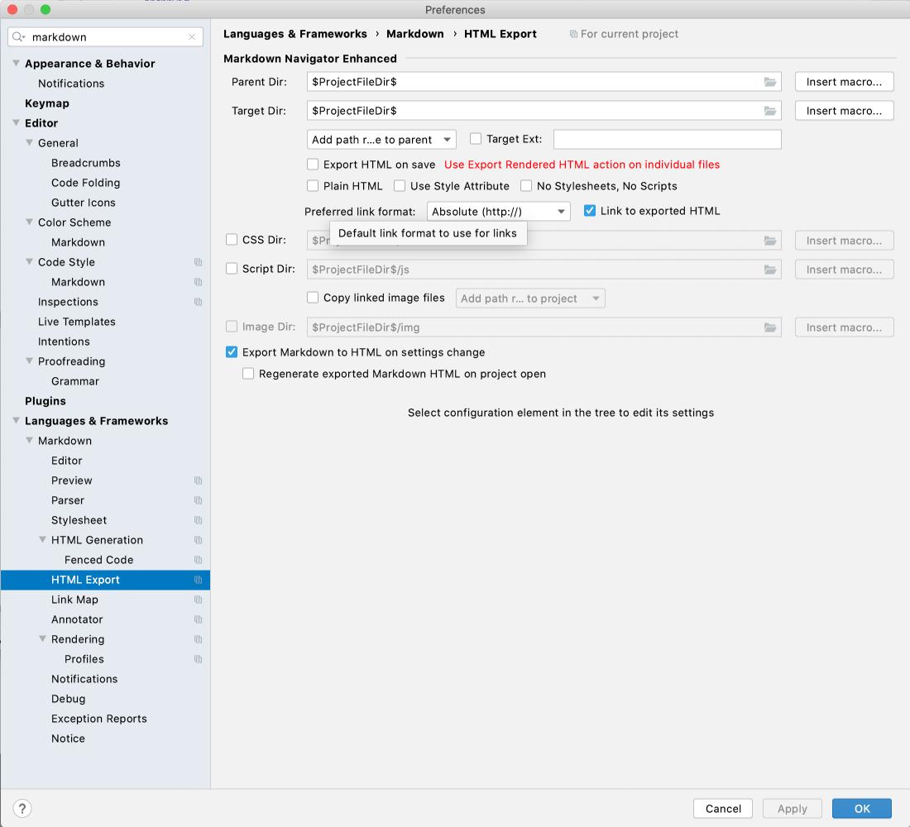
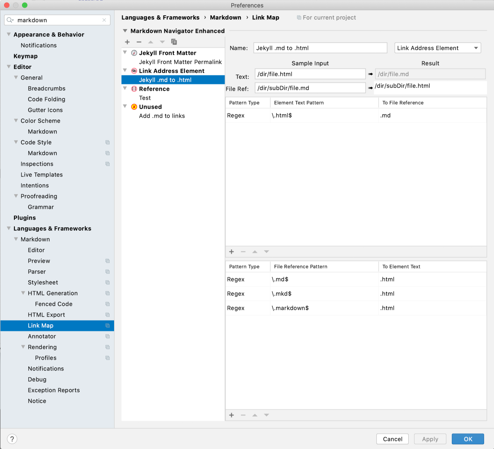
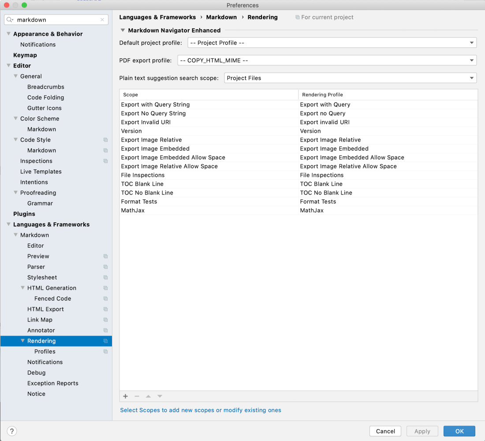
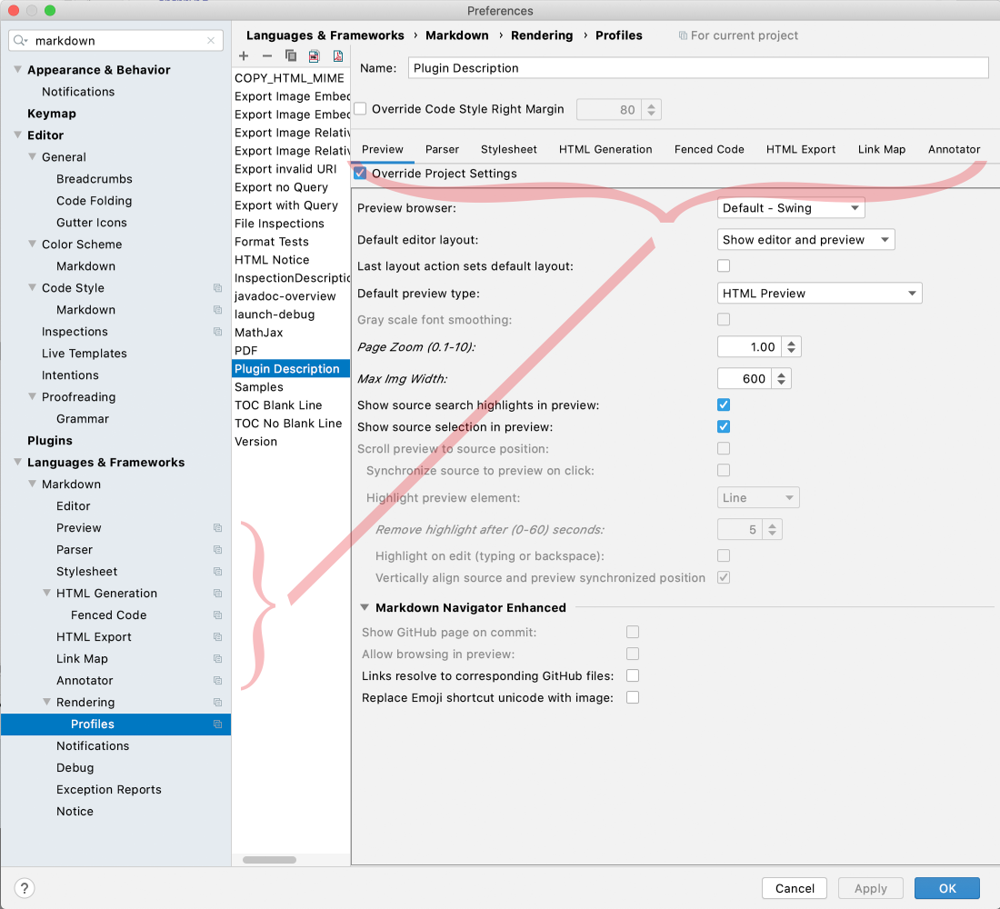

 Markdown Navigator 2.0
==========================================================================================================================================================

[TOC levels=2,3]: # "Table of Contents"

### Table of Contents
- [Overview](#overview)
    - [Document with pleasure!](#document-with-pleasure)
    - [Two tier model](#two-tier-model)
- [Release Road Map](#release-road-map)
    - [Future Release: Version 3.0.0](#future-release-version-300)
    - [Next Version 2.6.0](#next-version-260)
    - [Version 2.5.4](#version-254)
    - [Version 2.5.2](#version-252)
    - [Version 2.4.0](#version-240)
    - [Version 2.3.8](#version-238)
    - [Version 2.3.7](#version-237)
    - [Version 2.3.6](#version-236)
    - [Version 2.3.5](#version-235)
    - [Source Update is Long Overdue](#source-update-is-long-overdue)
- [Older Versions](#older-versions)
    - [Version 1.8.4](#version-184)
- [Rogues Gallery of Features](#rogues-gallery-of-features)
    - [Screenshots](#screenshots)
- [Background](#background)

## Overview

**[Markdown][Markdown] language support for IntelliJ
platform**

**A Markdown plugin** with GFM and a **matching** preview style.

**You can download it on the [JetBrains plugin page].**

**Get Markdown Navigator [enhanced edition][Markdown Navigator] to unlock all productivity
features.**

### Document with pleasure!

Work with [Markdown] files like you do with other languages in the IDE, by getting full support
for:

* **Paste images** into documents for fast screen capture links
* **Drag & Drop files and images** for fast link insertion
* **Formatting** to cleanup documents with a key stroke
* **Navigation and Find Usages** to find references without effort
* **Copy Markdown** as **JIRA**, **YouTrack** or **HTML** formatted text
* Convert **HTML to Markdown by pasting** it into a Markdown document.
* **Export** to **HTML** or **PDF** to share with others
* **Refactoring** of all referencing elements:
  * files ⟺ links
  * headings ⟺ ref anchors
  * footnotes ⟺ footnote refs
  * references ⟺ ref links/ref images
* **Completions** to reduce typing:
  * link address ⇐ files
  * ref anchors ⇐ headings
  * footnote refs ⇐ footnotes
  * ref links/ref images ⇐ references
  * link text ⇐ ref anchor/link address
* **Error and Warning** annotations to help catch mistakes early
* **Intention actions** for fast results with less effort
* **Wrap on Typing** to keep it nicely formatted as you edit
* **GitHub style rendering** that you are used to, out of the box
* **Fast typing response** for distraction free editing
* **Fully customizable** to adjust to your preferences and project needs

### Two tier model

1. Previewing and syntax highlighting functionality with a split editor is available in the
   Basic open source edition. Intended for mostly previewing markdown documents and unaided
   editing. Wiki link refactoring and completions are also available in the basic edition to
   ease the task of wiki maintenance.

2. Advanced features used for creating and maintaining markdown documents: refactoring, find
   usages, validation, auto formatting and HTML page customizations are only available in the
   Enhanced licensed version. 15-day free trial licenses are available from [Markdown Navigator]
   page on my website.

Release Road Map
----------------

### Future Release: Version 3.0.0

**Major Refactoring Release**

* Faster rendering solution to get around WebView caching issues and many large images slowing
  performance and overflowing memory.
* Improved Multiple Module Support
* Link resolution support for non-GitHub VCS providers
* Plus the usual bug fixes that come up between now and the release.

### Next Version 2.6.0

Bug and compatibility fixes you can find in [Version Notes].

* Add: **Tab/Backtab** overrides for table navigation and list indent/unindent actions
* Add: **Move Table Column** left/right actions
* Add **HTML Paste Options** to suppress generation of some markdown elements
* Add: **HTML comment folding** and options

### Version 2.5.4

Bug and compatibility fixes you can find in [Version Notes].

* **Shorten toolbar** by moving actions to popup menus
* **Folding of list items** when longer than one line of text
* **Options to disable gutter** margin and icons for markdown documents
* **Option to disable Rename To:** on spelling fix intention
* Experimental **Translate Document** [Powered by Yandex.Translate](http://translate.yandex.com/)

### Version 2.5.2

* Support for IDE versions 2016.3.8 or newer. Older IDEs can only use plugin version 2.4.0 and
  older.
* Google **Chrome Dev Tools** integrated for **JavaFX WebView** browser script debugging.
* **Directories** as link targets for completion, validation, navigation and drag/drop or
  copy/paste to create links
* **Settings management**: Copy project settings to/from project defaults and import/export
  project settings.
* **Anchors** of the form `<a .... attr=anchorId ...>...</a>` where `attr` is `id` or `name` to
  be treated as anchor ref targets. NOTE: the first `name` or `id` attribute will be treated as
  the "anchor target" the other as a reference to the anchor target. If both have the same
  string value then renaming one will rename the other.
* Project **Ref Anchor** explorer intention
* **Vertical Split** text/preview option
* **Help** topics for all settings panes
* **Text/Preview** toggle action option
* **[Attributes](https://github.com/vsch/idea-multimarkdown/wiki/Attributes-Extension)** Parser
  extension
* **[Enumerated References](https://github.com/vsch/idea-multimarkdown/wiki/Enumerated-References-Extension)**
  Parser extension
* **[Admonition](https://github.com/vsch/idea-multimarkdown/wiki/Admonition-Extension)**, Parser
  extension based on [Admonition Extension, Material for MkDocs]

### Version 2.4.0

* [CommonMark (spec 0.28)] compliant
* Navigate using links with **GitHub Line Reference** anchor refs
* **Code Folding** of Headings
* **Code Folding** option in settings for **embedded image links**
* **Copy Reference** then Paste to get **link with line reference**
* **Encode/Decode Base64 Images** Intention
* Paste Images with **Base64 Encoded** embedded image links
* **Embed Images** HTML generation option
* **Base64 embedded image** display in **Swing browser**
* **Convert Markdown to HTML** intention for fenced code elements

### Version 2.3.8

* Add GitHub Line reference anchors in the form `L#` or `L#-L#` for line ranges. Now navigating
  to such an anchor in a project file will move the caret to the line and if second form is used
  select the lines.
* Add clicking on task item box in preview toggles open/closed task status in source (JavaFX
  browser).
* Add Apply all '...' in file intentions where these make sense.
* Add intention to convert between typographic symbols and markdown smarts/quotes extension
  text.
* Add `HTML block deep parsing` parser option to allow better handling of raw text tag parsing
  when they are not the first tag on the first line of the block.
* Add Launching external URLs inside the browser, now `navigate to declaration` opens url in
  browser, ftp or mail client depending on the link. Can also use line markers for navigation of
  these elements.
* Add GitBook compatible include tags when `GitBook compatibility mode` is enabled in `Parser`
  options.
* Add handling of optional quotes for jekyll include tags. Either single `'` or double `"`
  quotes will be ignored if the file name is wrapped in them.
* Add Insert table column on right actions and changed description of previous action to insert
  table column on left.
* Add #411, Network drives links are not resolved correctly, URI links outside of project now
  error highlighted if the file does not exist
* Add #433, Support external links for the Link Map (eg. JIRA link), Reference to Link Map to
  allow creating automatic reference URLs from Reference IDs
* Fix HTML generation with line source line highlighting when inline styling spans source lines
* Fix #459, PDF export does not resolve local ref anchors
* Fix #456, Register r markdown code chunk prefix
* Fix #453, Option to hide toolbar
* Fix breadcrumb tooltip of task items would be missing the task item marker
* Fix #447, Exported HTML has unexpected CSS and JS URLs
* Fix #445, there should no be default language injection in bare code chunks
* Fix #444, Markdown Navigator 2.3.7 breaks paste of github checkout url
* Fix #441, false positive typo annotation in header, caused by using IdentifierSplitter instead
  of TextSplitter to handle elements that can have references.
* Fix #442, Image Paste in Windows always pastes absolute file:// regardless of selection
* Fix #440, Auto links should not appear in fenced code

### Version 2.3.7

* Fix erroneous escape sequence processing in fenced code block content causing parser exception
  in some circumstances.

### Version 2.3.6

:warning: GitHub has changed its Markdown document parsing to CommonMark which mostly affects
the parsing and results of lists. You may need to change list syntax in parser options to
`CommonMark` from `GitHub`

* Add Heading anchor ID display in editor
* Add annotation to detect when list syntax is set to GitHub

### Version 2.3.5

* File Drop/Paste operation options based on caret location.

  

* `Copy Modified Image to Clipboard` in Copy/Paste Image Dialog to replace clipboard image
  contents with modified image, can use it to replace image on clipboard then Cancel dialog to
  not modify the Markdown document but still have the modified image on the clipboard.

  

* Copy/Modify Image intention that will open the Image Copy/Paste Dialog for the image content
  of the image link element at caret position. Works with local files and URLs. Get the option
  to change directory, file name and modify the image.

* Markdown application settings for:
  * `Use clipboard text/html content when available` disabled by default, enabling it will allow
    pasting text/html when available
  * `Convert HTML content to Markdown` enabled by default, disabling will paste text/html
    content without conversion to Markdown

  

* Option highlight selection in preview, `Show source selection in preview` enabled by default.
  Wraps selection in `` with `selection-highlight` class.

* Option to highlight search results in preview, `Show source search highlights in preview`
  enabled by default. Wraps search highlights in `` with `search-highlight` class.

* Option to vertically align synchronized position in Preview Settings, selected by default in
  Preview settings.

### Source Update is Long Overdue

Now that I unified the display between the licensed and unlicensed versions by removing support
for preview tabs in favour of split editor as the only option, I will be updating the open
source with a new version much easier.

The update will be more like a replacement of the source than an evolution of it. The directory
structure has changed significantly and a lot of Java has been converted to Kotlin.

The enhanced version is now 120k lines of code so my goal is to separate the open source
functionality from the proprietary code with a clean boundary to make open source releases
synchronized with plugin releases like they used to be but without the need for manual merging
between the two.

#### Working with the source

Standard IntelliJ Plugin development environment.

#### Some internal details, should you care to know

The [pegdown][] [Markdown] parser used by the plugin in its original incarnation was changed to
[flexmark-java] and [pegdown] dependencies have been removed as of version 2.2.0.

[flexmark-java] is my fork of [commonmark-java], with changes:

* source element based AST with detailed break down of each element for syntax highlighting
* complete source position tracking for all elements and their lexical parts
* optimized for efficient parsing with many parser extensions installed
* unified core and extension options API to simplify parser/renderer configuration
* options to tweak core parser rules

In the process of making the needed modifications to the original [commonmark-java] parser,
performance was impacted by about 25-35%. This still makes the new parser **7x-10x** faster than
[intellij-markdown] parser used by [Markdown Support] and **25x-50x** faster than pegdown. As an
added benefit, the new parser does not suffer from pegdown's idiosyncrasies of exponential parse
times or pathological input cases that cause infinite loops in the parser's state machine.

On the coding end, the new parser is a joy to maintain and enhance. The parser architecture,
inherited from [commonmark-java], is easy to debug and test. Markdown element parsers have
little or no interdependencies with other element parsers making it easy to fine tune parser
behaviour on a per element basis and add parser configuration options to emulate other markdown
processors. All this is in contrast to pegdown's one big PEG grammar implementation with
everything potentially inter-dependent.

Older Versions
--------------

### Version 1.8.4

:warning: This is the last release using [pegdown] and compatible with JRE 1.6. Later releases
are based on the [flexmark-java] and require JRE 1.8.

* Project module names added to inline code completions

* More flexible inline code completions, will allow qualified class names and multi-class name
  matches when completing members. If more than one class name matches then the combined set of
  members is used from all matched classes.

* Inline code elements are now treated as literal so that classes, methods and fields can be
  refactored with search in strings.

  :warning: this only works if syntax highlighting is set to lexer not annotator. Lexer used
  when annotator syntax highlighting is selected only distinguishes html comments from plain
  text. The comments are needed to allow for TODO processing to work with either highlighter.

Rogues Gallery of Features
--------------------------

* JavaFX preview scroll to source with highlight element in preview

  

* **Table of Contents** tag that works with basic markdown syntax and is updated by the plugin.
  The table of contents at the top of this page is an example. For more information see the
  [wiki](../../wiki/Table-of-Contents-Extension#enabling-table-of-contents)

* Java class, method and field completions in inline code. Great if you need to reference code
  elements in your project from a markdown document.

* toolbar buttons and actions, see [Enhanced Features](../../wiki/Enhanced-Features)

  

* **Document Structure View** with sections for:
  * Headers to show header hierarchy by level
    
  * Images
  * Links
  * References
  * Tables
  * Footnotes
  * Abbreviations
  * Document section showing all abbreviations, block quotes, footnotes, headers, images, lists,
    references and tables in the document. According to markdown element hierarchy and in order
    of their location in the document.
    

* **Document format** toolbar button and action to format the document to code style settings.
  [Document Format Options](../../wiki/Document-Format-Settings)

* Dynamically created syntax highlighting attributes to simulate overlay of element style with
  transparency. This creates consistent colors when multiple attributes are combined, such as
  inline elements in tables, headers and definition terms. Additionally allows for bold, italic,
  and effect type and color to be combined for nested markdown inline elements.
  

* Actual character display font width can be used for wrapping and table formatting, allowing
  best alignment for multi-byte characters and proportional fonts:

  With character width taken into account:
  

  Without taking character width into account:
  

* **Block Quote** increase/decrease level toolbar buttons and actions.

* **Emoji** support added to preview.

* Toolbar, Live Template and Table editing improved. See
  [Enhanced Features](../../wiki/Enhanced-Features).

### Screenshots

##### Create and edit a markdown table with ease:

##### Still Great GitHub Rendering Resemblance for your preview pleasure

##### Split your editor and see the preview as you type

##### Peek at the HTML

###### Change options, customize the syntax colors and CSS to your liking.

Background
----------

It all started with a desire to see Markdown files in PhpStorm IDE as they would look on GitHub.
I was already using [nicoulaj/idea-markdown plugin] but found its preview was more like
[Craig's List] than [GitHub]. It did not appear to have been recently updated, so I decided to
fork it and modify the style sheet it uses. How hard could that be?

I found out quickly that there was more to it than meets the eye. Rendering is done by Java not
a browser, the parser is HTML 3.1 and not all features are implemented. Additionally, the Table
extension did not work in the version of `pegdown` used by the plugin. I needed that because
maintaining HTML tables is a pain. So I upgraded the plugin to use the latest `pegdown`,
`parboiled` and fixed a few bugs. Since I was already in the code, I might as well add a few
more desired features like user editable style sheet, fix a few more bugs, add updates to
preview so that I could split the editor pane and edit in one while seeing the preview in the
other.

Then I encountered some bugs in parsing of compound nested lists in `pegdown` and had to dive
into its source to fix them. Having done that and gotten familiar with it, I decided to add a
new extension. Finally, to help me with debugging and generating test expectations for
`pegdown`, I had to have the HTML Text tab to display the generated HTML.

It has been a fun trip down the rabbit hole of IntelliJ IDEA plugin development that started
with a simple desire for a Markdown preview that looked like GitHub's.

---

\* This plugin was originally based on the [nicoulaj/idea-markdown plugin] by [nicoulaj], which
was based on [pegdown] library by [sirthias].

Markdown Navigator, Copyright (c) 2015-2018, V. Schneider, <http://vladsch.com> All Rights
Reserved.

[Admonition Extension, Material for MkDocs]: https://squidfunk.github.io/mkdocs-material/extensions/admonition/
[CommonMark (spec 0.28)]: http://spec.commonmark.org/0.28/
[commonmark-java]: https://github.com/atlassian/commonmark-java
[Craig's List]: http://montreal.en.craigslist.ca/
[flexmark-java]: https://github.com/vsch/flexmark-java
[GitHub]: https://github.com/vsch/laravel-translation-manager
[intellij-markdown]: https://github.com/valich/intellij-markdown
[JetBrains plugin page]: https://plugins.jetbrains.com/plugin?pr=&pluginId=7896
[Markdown]: http://daringfireball.net/projects/markdown
[Markdown Navigator]: http://vladsch.com/product/markdown-navigator
[Markdown Support]: https://plugins.jetbrains.com/plugin/7793?pr=
[nicoulaj]: https://github.com/nicoulaj
[nicoulaj/idea-markdown plugin]: https://github.com/nicoulaj/idea-markdown
[pegdown]: http://pegdown.org
[sirthias]: https://github.com/sirthias
[Version Notes]: https://github.com/vsch/idea-multimarkdown/blob/master/resources/META-INF/VERSION.md
[.gitignore]: http://hsz.mobi
[Android Studio]: http://developer.android.com/sdk/installing/studio.html
[AppCode]: http://www.jetbrains.com/objc
[CLion]: https://www.jetbrains.com/clion
[CommonMark]: http://commonmark.org/
[Copy Jira]: https://github.com/vsch/idea-multimarkdown/raw/master/resources/icons/editor_actions/Copy_jira.png
[Copy Markdown to HTML formatted text]: https://github.com/vsch/idea-multimarkdown/wiki/Enhanced-Features#copy-markdown-to-html-formatted-text
[DataGrip]: https://www.jetbrains.com/datagrip
[GitHub Issues]: https://github.com/vsch/idea-multimarkdown/issues
[GitHub Issues page]: https://github.com/vsch/idea-multimarkdown/issues/
[GitHub wiki in IntelliJ IDE]: https://github.com/vsch/idea-multimarkdown/wiki/Adding-GitHub-Wiki-to-IntelliJ-Project
[GitHub Wiki pages]: https://github.com/vsch/idea-multimarkdown/wiki
[GitHub-userscripts]: https://github.com/Mottie/GitHub-userscripts
[holgerbrandl/pasteimages]: https://github.com/holgerbrandl/pasteimages
[IntelliJ IDEA]: http://www.jetbrains.com/idea
[Jekyll]: https://jekyllrb.com
[JetBrains plugin comment and rate page]: https://plugins.jetbrains.com/plugin/writeComment?pr=&pluginId=7896
[Kotlin]: http://kotlinlang.org
[Kramdown]: http://kramdown.gettalong.org/
[Modifying Link Processing]: https://github.com/vsch/idea-multimarkdown/wiki/Link-Map-Settings
[MultiMarkdown]: http://fletcherpenney.net/multimarkdown/
[Pandoc]: http://pandoc.org/MANUAL.html#pandocs-markdown
[PhpExtra]: https://michelf.ca/projects/php-markdown/extra/
[PhpStorm]: http://www.jetbrains.com/phpstorm
[Pipe Table Formatter]: https://github.com/anton-dev-ua/PipeTableFormatter
[PyCharm]: http://www.jetbrains.com/pycharm
[RubyMine]: http://www.jetbrains.com/ruby
[sirthias/pegdown]: https://github.com/sirthias/pegdown
[vsch/pegdown]: https://github.com/vsch/pegdown/tree/develop
[WebStorm]: http://www.jetbrains.com/webstorm
[Wiki]: https://github.com/vsch/idea-multimarkdown/wiki

